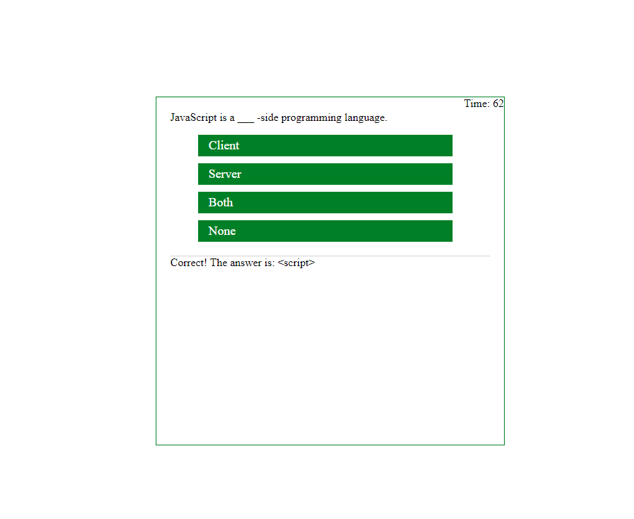

# hw-4-code-quiz

Homework 4 of GT bootcamp is the JavaScript Quiz

In this homework, we created a timed JS quiz which deducts point for each wrong answer.

Live demo:

<https://arashkyoosha.github.io/hw-4-code-quiz/>

